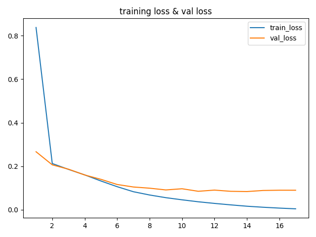
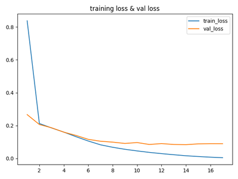

### 概述

在NLP的[序列标注任务](https://hpeiyan.github.io/2019/07/31/sequence-mark/)里面，NER是基础的上游任务，也就意味着，业界许多垂直领域的NLP项目，NER是绕不开的任务。今天的这篇博客，笔者不想涉及深入的算法和数学知识，仅就在代码实现层面，对有监督的NER训练，做一些介绍。对于NER一知半解的读者，可以移步笔者的另一篇博文——[《命名实体识别概述》](https://hpeiyan.github.io/2019/07/31/NER/)。

### 技能要求

1. Python 3
2. Keras框架
3. Log、Matplotlib、TensorFlow等辅助工具

### 项目目标

1. 根据已经标记的NER数据集，训练得到NER模型；
2. 用NER模型，预测新数据；

### 项目目录

```bash
➜  Keras-NER tree
.
├── __init__.py
├── config.py # 配置文件，项目的常量和超参数
├── keras_run.py # 项目的执行文件
├── log # 日志
│   ├── __pycache__
│   │   └── log.cpython-36.pyc
│   ├── log.py
│   └── logging.log
├── model # 训练好的模型权重
│   └── best.model.weight
├── model.py # 模型，提供训练、预测
├── resource # 数据集
│   ├── predict.txt
│   ├── predict_label.txt
│   ├── source.txt
│   ├── source_vocb.txt
│   ├── target.txt
│   └── tgt_vocb.txt
└── utils.py

5 directories, 18 files
```

### 项目

#### 数据集

1. 训练的原始数据

```py
新华社 北京 六月 十日 电 中宣部 、 教育部 、 团中央 和 全国学联 近日 联合 发出通知 ， 决定 今年 暑期 继续 深入开展 大中学生 志愿者 文化 、 科技 、 卫生 『 三下乡 』 活动 。
三年 来 ， 我 先后 给 亲友 的 六个 孩 子 找 过事 ， 有 几个 还是 托 了 两三层 的 关系 才 办成 的 。
去年 春天 ， 职工 何新荣 9 岁 的 孩子 得 了 白血病 ， 家里 负担 不起 啊 ！
在 女子 53 公斤 级 比赛 中 ， 广东 选手 郭惠冰 4 破 成人 世界纪录 ， 令人叹服 。
......
```

2. 原始数据对应的标记数据：

```python
B-ORG B-LOC B-TIME I-TIME O B-ORG O B-ORG O B-ORG O B-ORG B-TIME O O O O B-TIME I-TIME O O B-ROLE I-ROLE O O O O O O O O O O
B-TIME I-TIME O O B-TIME O B-ROLE O B-ROLE I-ROLE O O O O O O O O O O O O O O O O
B-TIME I-TIME O B-ROLE B-PER O O O O O O O O B-LOC O O O O
O O O O O O O O B-LOC B-ROLE B-PER O O O O O O O
......
```

3. 预测的原始数据：

```python
进一步 研究 已经 发现 了 有关 这个 “ 钥匙 ” 的 功能 及其 薄弱环节 。
韩国 已 开始 实施 初步 的 紧缩 政策 ， 决定 把 1998 年 预算 削减 10 ％ 以上 ， 并 拟定 出 金融 改革方案 ， 取消 对 外汇 、 资本 流通 和 利率 的 所有 管制 ， 逐步 允许 外国 金融机构 接管 和 收购 部分 韩国 金融机构 。
甜 的 咸 的 ， 干 的 稀 的 ， 素 的 荤 的 ， 应有尽有 ， 让 我们 望而生畏 。
.....
```


#### 模型搭建

```python
    def __build_model__(self):
        model = Sequential()
        emb = layers.Embedding(input_dim=MAX_FEATURE, output_dim=embedding_size, input_length=MAX_LEN)
        bdr = Bidirectional(layers.LSTM(64, return_sequences=True))
        crf = CRF(get_label_counts() + 1, sparse_target=True)

        model.add(emb)
        model.add(bdr)
        model.add(crf)

        model.summary()
        model.compile(optimizer='adam', loss=crf.loss_function, metrics=[crf.accuracy])
        return model
```

这里要特别注意：

1. `Embedding`的三个参数，`input_dim`是指`Embedding`层要接收的特征维度，比如，在本项目中就是要输入的前`MAX_FEATURE`个出现频率较高的词汇。`output_dim`是输出给下层的维度，`input_length`则是对于每个`sample`，截取前`MAX_LEN`个词汇作为输入，不足的会用0填充（也可以自己指定其他数字，默认是0）。
2. CRF的算法没有在keras「原装包」中，需要另外导入`keras-contrib`包。第一个接受的参数是输出的类型数量，这里+1的是因为在对数据进行填充（padding）的时候，额外引进了填充的类别。
3. 损失函数和指标都选用了`CRF`自带的函数。

#### 生成数据

```python
def generate_data():
    with open(src_file, 'r') as f:
        sentences = f.readlines()

    tk = Tokenizer(num_words=MAX_FEATURE, filters=' \n')
    tk.fit_on_texts(sentences)
    sen_sqc = tk.texts_to_sequences(sentences)

    sen_sqc_pad = pad_sequences(sen_sqc, maxlen=MAX_LEN)

    with open(source_vocb_path, 'w') as f:
        f.write(str(tk.index_word))

    with open(tgt_file, 'r') as f:
        tgt = f.readlines()

    tk_tgt = Tokenizer(num_words=MAX_FEATURE, filters=' \n')
    tk_tgt.fit_on_texts(tgt)
    tgt_sqc = tk_tgt.texts_to_sequences(tgt)
    tgt_sqc_pad = pad_sequences(tgt_sqc, maxlen=MAX_LEN)
    with open(tgt_vocb_path, 'w') as f:
        f.write(str(tk_tgt.index_word))

    if is_dev():
        sen_sqc_pad = sen_sqc_pad[:MAX_SAMPLE]
        tgt_sqc_pad = tgt_sqc_pad[:MAX_SAMPLE]

    log.i('sen shape: {}, tgt shape:{}'.format(sen_sqc_pad.shape, tgt_sqc_pad.shape))

    # tgt_sqc_pad = np.expand_dims(tgt_sqc_pad, 2)
    tgt_sqc_pad = tgt_sqc_pad.reshape((tgt_sqc_pad.shape[0], tgt_sqc_pad.shape[1], 1))
    X_train, X_test, y_train, y_test = train_test_split(sen_sqc_pad, tgt_sqc_pad, test_size=0.2)
    log.i('generate data finish')

    return X_train, X_test, y_train, y_test
```

最主要的地方是利用了`Keras`的`Tokenizer`，对词汇进行唯一标识。

### 项目成果

1. 训练准确度：

   

2. 预测结果：

```python
['进一步(o)', '研究(o)', '已经(o)', '发现(o)', '了(o)', '有关(o)', '这个(o)', '“(o)', '钥匙(o)', '”(o)', '的(o)', '功能(o)', '及其(o)', '薄弱环节(o)', '。(o)']

['韩国(b-loc)', '已(o)', '开始(o)', '实施(o)', '初步(o)', '的(o)', '紧缩(o)', '政策(o)', '，(o)', '决定(o)', '把(o)', '1998(b-time)', '年(i-time)', '预算(o)', '削减(o)', '10(o)', '％(o)', '以上(o)', '，(o)', '并(o)', '拟定(o)', '出(o)', '金融(o)', '改革方案(o)', '，(o)', '取消(o)', '对(o)', '外汇(o)', '、(o)', '资本(o)', '流通(o)', '和(o)', '利率(o)', '的(o)', '所有(o)', '管制(o)', '，(o)', '逐步(o)', '允许(o)', '外国(o)', '金融机构(o)', '接管(o)', '和(o)', '收购(o)', '部分(o)', '韩国(b-loc)', '金融机构(o)', '。(o)']

['甜(o)', '的(o)', '咸(o)', '的(o)', '，(o)', '干(o)', '的(o)', '稀(o)', '的(o)', '，(o)', '素(o)', '的(o)', '荤(o)', '的(o)', '，(o)', '应有尽有(o)', '，(o)', '让(o)', '我们(o)', '望而生畏(o)', '。(o)']

['在(o)', '这种(o)', '心理(o)', '的(o)', '趋动(o)', '下(o)', '，(o)', '敢(o)', '冒风险(o)', '的(o)', '股民(o)', '越来越(o)', '多(o)', '。(o)']

['当年(o)', '全县(o)', '上下(o)', '一盘棋(o)', '，(o)', '从(o)', '抓(o)', '计划生育(o)', '着眼(o)', '促进(o)', '经济(o)', '发展(o)', '入手(o)', '，(o)', '成效显著(o)', '。(o)']

['傅全有(b-per)', '说(o)', '，(o)', '领导(o)', '方法(o)', '“(o)', '十六(o)', '字(o)', '”(o)', '方针(o)', '，(o)', '是(o)', '新形势下(o)', '加强(o)', '党委(o)', '建设(o)', '的(o)', '根本(o)', '指导方针(o)', '。(o)']
......
```

### [项目GitHub](https://github.com/hpeiyan/Keras-NER.git)


